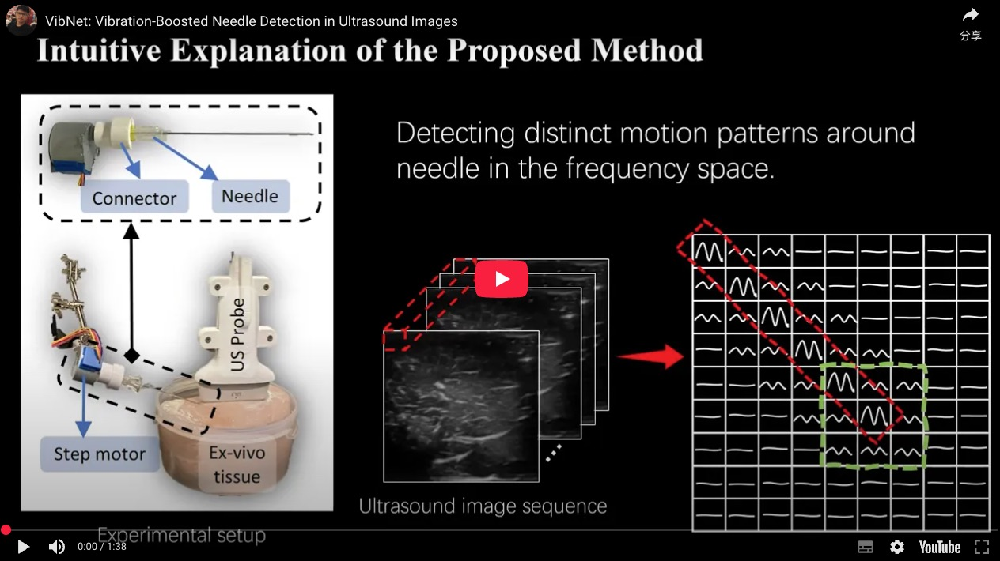

# VibNet: Vibration-Boosted Needle Detection in Ultrasound Images

This repository contains the official code of the IEEE TMI paper "[VibNet: Vibration-Boosted Needle Detection in Ultrasound Images](https://arxiv.org/abs/2403.14523)".

## Abstract

Precise percutaneous needle detection is crucial for ultrasound (US)-guided interventions. However, inherent limitations such as speckles, needle-like artifacts, and low resolution make it challenging to robustly detect needles, especially when their visibility is reduced or imperceptible. To address this challenge, we propose VibNet, a learning-based framework designed to enhance the robustness and accuracy of needle detection in US images by leveraging periodic vibration applied externally to the needle shafts. VibNet integrates neural Short-Time Fourier Transform and Hough Transform modules to achieve successive sub-goals, including motion feature extraction in the spatiotemporal space, frequency feature aggregation, and needle detection in the Hough space. Due to the periodic subtle vibration, the features are more robust in the frequency domain than in the image intensity domain, making VibNet more effective than traditional intensity-based methods. To demonstrate the effectiveness of VibNet, we conducted experiments on distinct *ex vivo* porcine and bovine tissue samples. The results obtained on porcine samples demonstrate that VibNet effectively detects needles even when their visibility is severely reduced, with a tip error of $1.61\pm1.56mm$ compared to $8.15\pm9.98mm$ for UNet and $6.63\pm7.58mm$ for WNet, and a needle direction error of $1.64\pm1.86^{\circ}$ compared to $9.29\pm15.30^{\circ}$ for UNet and $8.54\pm17.92^{\circ}$ for WNet.

[](https://www.youtube.com/watch?v=lXzHw0crPaM)

## Installation

```bash
# Create conda environment
conda create -n vibnet python=3.11

# Install torch (be careful of the cuda version)
pip install torch --index-url https://download.pytorch.org/whl/cu118

# install packages
pip install -r requirements.txt

# Install deep-hough-transform
cd model/_cdht
python setup.py install --user
# if errors occurred, try this:
# pip install . --user
```

## Usage

- Prepare dataset
  1. Download `dataset.zip` from the [release](https://github.com/marslicy/VibNet/releases).
  2. Unzip the dataset using `unzip dataset.zip`.
- Training
  1. Set model parameters and training parameters in `config.py`.
  2. Generate the data split in `{data_path}/train.txt` and `{data_path}/val.txt`
  3. Run `python train.py`.
- Evaluation
  1. Set parameters at the end of `test.py`.
  2. Run `python test.py`.
  3. After the test, the results will be saved in `{save_path}`, and it will print errors in the console. (theta in degree, rho and tip in mm)
- Visualization
  1. Set parameters at the end of `predict.py`.
  2. Run `python predict.py`.
  3. Output videos will be saved in the `{output_dir}`.

## Code Structure

- `dataset/` contains data samples from our test dataset. The existing data splits are the same for training, validation, and testing; you may need to modify them.
- `config.py` will be loaded automatically when training the model.
- `train.py` can be executed directly to train the model after you set `config.py`.
- `predict.py` is used for prediction and visualizing results using a well-trained model.
- `utils.py` contains a lot of functions that are used by multiple scripts.
- `/logs` contains the training logs and can be read using `tensorboardx`. Each training log contains the trained model and the config file used for training this model.
- `/model` contains code about the model.
- `/infer` contains code for inference.
- Most Python scripts can be run using `PYTHONPATH='.' python '{file path}'`. The last part of each script shows an example about how to use the classes/functions written in the file.

## Acknowledgement

Big Thanks for the open source codes from:

- [Learning-based Video Motion Magnification](https://github.com/ZhengPeng7/motion_magnification_learning-based), where we used the code for the motion encoder and pretrained encoder model.
- [UniTS: Short-Time Fourier Inspired Neural Networks for Sensory Time Series Classification](https://github.com/Shuheng-Li/UniTS-Sensory-Time-Series-Classification), where we used the code for FIC module.
- [Deep Hough Transform for Semantic Line Detection](https://github.com/Hanqer/deep-hough-transform), where we used the code for the deep Hough transform.

## Citation

If you find our paper and code useful, please cite us:

```
@article{huang2025vibnet,
  author  = {Huang, Dianye and Li, Chenyang and Karlas, Angelos and Chu, Xiangyu and Au, K. W. Samuel and Navab, Nassir and Jiang, Zhongliang},
  title   = {VibNet: Vibration-Boosted Needle Detection in Ultrasound Images},
  journal = {IEEE Transactions on Medical Imaging},
  year    = {2025},
}
```
